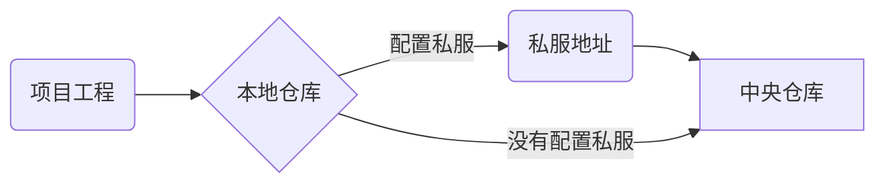

<h1 align="center" style="border-bottom:none" >CityserverX服务框架基础部分</h1>

## 文档首页

| 版本  | 时间       | 修改人 | 说明                                          |
| ----- | ---------- | ------ | --------------------------------------------- |
| 1.1.0 | 2018-08-02 | 柯尊超 | 1.增加Spring介绍<br />2.增加mybatis的相关知识 |
| 1.0.0 | 2018-07-21 | 柯尊超 | 基于Springboot的全新框架                      |
|       |            |        |                                               |

[TOC]

## 前言

### 服务框架现状

（待补充···）

## 一、CityserverX

### 1.介绍

　CityserverX是一个基于SpringBoot2.0的搭建的MOA框架--面向模块开发框架，力争做到开发人员只需要关心业务逻辑。具有以下特点：

+ 模块耦合度低
+ 模块按需打包、按需部署
+ 自由的模块扩展
+ 统一的返回模型
+ 统一异常处理与日志记录
+ 全局API接口鉴权

### 2.CityServerX

　　“X”代表未来，这是一个既可以快速继承现有的代码，又可以面向未来的微服务框架平滑升级。

### 3.框架功能进展

- [x] 框架基础搭建
- [x] 统一接口返回结果模型
- [x] 全局异常处理与日志记录
- [x] 集成Swagger2生成REST文档
- [x] 全局API接口鉴权
- [x] Redis的工具类封装
- [ ] Mongodb操作工具封装(Colletion和GridFS)
- [ ] 服务监控(异常报警、数据源监控等)


## 二、基础环境

- Git: 种子文件托管空间([git常用命令](#annex_git))
- Maven：包依赖管理
- JAVA：java编译，版本统一为 ==jdk1.8==
- IDE：统一为`IntelliJ IDEA `, 不反对使用MyEclipse，但是不提供支持。

## 三、Maven核心概念

### 1.项目对象模型


　　maven根据pom.xml文件，把它转化成项目对象模型(POM)，这个时候要解析依赖关系，然后去相对应的maven库中查找到依赖的jar包。

　　在clean，compile，test，package等阶段都有相应的Plug-in来做这些事情，而这些plug-in会产生一些中间产物。

### 2.Maven仓库

+ :star:本地仓库：每一个用户也可以拥有一个本地仓库，位置`~/.m2/repository/`

+ :star:远程仓库

  + 中央仓库：Maven默认的[远程仓库](http://repo1.maven.org/maven2)
  + 私服：特殊的远程仓库，隶属于某个企业，通常架设在局域网内
  + 镜像：用来替代中央仓库，速度一般比中央仓库快

  **maven项目管理示意图**



### 3.Maven对象模型组成

　　Maven的项目对象模型（POM）组成四要素：

+ **groupId**：组织ID，定义项目属于组织，如`com.zzht`
+ **artifactId**：项目或模块标识，如`sp-demo`
+ **version**：定义当前项目的版本号
+ **packaging**：定义当前项目的打包方式

根据这些要素，可以在Maven仓库中找到唯一的项目资源包。

### 4.Maven的依赖管理和继承

Maven按照POM的管理要素进行资源的依赖管理，父子项目的POM通过**parent**来建立继承关系。

```xml
<?xml version="1.0" encoding="UTF-8"?>
<project xmlns="http://maven.apache.org/POM/4.0.0" xmlns:xsi="http://www.w3.org/2001/XMLSchema-instance"
         xsi:schemaLocation="http://maven.apache.org/POM/4.0.0 http://maven.apache.org/xsd/maven-4.0.0.xsd">
    <modelVersion>4.0.0</modelVersion>

    <groupId>com.zzht</groupId>
    <artifactId>demo-web</artifactId>
    <version>0.0.1-SNAPSHOT</version>
    <packaging>jar</packaging>

    <name>demo-web</name>
    <description>Demo project for Spring Boot</description>

    <parent>
        <groupId>com.zzht</groupId>
        <artifactId>city-server</artifactId>
        <version>0.0.1-SNAPSHOT</version>
    </parent>

    <properties>
        <project.build.sourceEncoding>UTF-8</project.build.sourceEncoding>
        <project.reporting.outputEncoding>UTF-8</project.reporting.outputEncoding>
        <java.version>1.8</java.version>
    </properties>

    <dependencies>
        <dependency>
            <groupId>com.zzht</groupId>
            <artifactId>demo-controller</artifactId>
            <version>0.0.1-SNAPSHOT</version>
        </dependency>
    </dependencies>
```

### 5.Maven项目约定

maven项目的结构有固定的约定：

```bash
|--src                   # 源码
|  |--main               # 项目代码
|  |  |--java            # java代码
|  |  |--resources       # 配置文件，静态文件等资源
|  |--test               # 测试代码
|  |  |--java            # 测试的java代码
|  |  |--resources       # 测试的资源文件
|--target                # 编译目录
|  |--classes            # 编译文件
|  |--test-classes       # 测试的编译文件
|  |--surefire-reports   # 测试报告
|--pom.xml               # POM配置文件，依赖和编译打包等配置
```

### 6.Maven的打包和安装

+ :triangular_flag_on_post:**mvn clean**：清除掉编译输出目录，即target。

+ :triangular_flag_on_post: **mvn package**：打包（jar等）到本项目的target下。 

+ :triangular_flag_on_post:**mvn install**：把target下打的包（jar等）安装到本地仓库，可以供其他项目使用。

  打包时候配合`mvn clean`使用，可以组合使用`mvn clean install`

## 四、Spring全家桶

### 1.Sping/SpringMVC/Springboot发展过程

　　spring 框架全家桶，有众多衍生产品例如 boot、security、jpa等等。他们的基础都是Spring 的 ioc和 aop 。ioc 提供了依赖注入的容器 ，aop 解决了面向横切面的编程，然后在此两者的基础上实现了其他延伸产品的高级功能。Spring MVC是基于 Servlet 的一个 MVC 框架 主要解决 WEB 开发的问题，因为 Spring 的配置非常复杂，各种XML、 JavaConfig，处理起来比较繁琐。于是为了简化开发者的使用，从而创造性地推出了Springboot，<u>约定优于配置，简化了spring的配置流程</u>。

　　Spring 最初利用“工厂模式”（DI）和“代理模式”（AOP）解耦应用组件。于是按照这种模式搞了一个 MVC框架（一些用Spring 解耦的组件），用来开发 web 应用（ SpringMVC ）。然后有发现每次开发都写很多样板代码，为了简化工作流程，于是开发出了一些“懒人整合包”（starter），这套就是 Spring Boot。

**总结：**

+ Spring 是一个“引擎”；
+ Spring MVC 是基于Spring的一个 MVC 框架 ；
+ Spring Boot 是基于Spring的一套快速开发整合包。

### 2.SpringMVC功能  

　　Spring MVC是Spring的一个模块式web框架。通过Dispatcher Servlet, ModelAndView 和 View Resolver，开发web应用变得很容易。解决的问题领域是网站应用程序或者服务开发——URL路由、Session、模板引擎、静态Web资源等等。

### 3.SpringBoot功能 

一句话：**Spring Boot实现了自动配置，降低了项目搭建的复杂度。** 

　　Spring框架需要进行大量的配置，Spring Boot引入自动配置的概念，让项目设置变得很容易。Spring Boot本身并不提供Spring框架的核心特性以及扩展功能，只是用于快速、敏捷地开发新一代基于Spring框架的应用程序。也就是说，它并不是用来替代Spring的解决方案，而是和Spring框架紧密结合用于提升Spring开发者体验的工具。同时它集成了大量常用的第三方库配置(例如Jackson, JDBC, Mongo, Redis, Mail等等)，Spring Boot应用中这些第三方库几乎可以零配置的开箱即用(out-of-the-box)，大部分的Spring Boot应用都只需要非常少量的配置代码，开发者能够更加专注于业务逻辑。

　　Spring Boot只是承载者，辅助你简化项目搭建过程的。如果承载的是WEB项目，使用Spring MVC作为MVC框架，那么工作流程和你上面描述的是完全一样的，因为这部分工作是Spring MVC做的而不是Spring Boot。

　　对使用者来说，换用Spring Boot以后，项目初始化方法变了，配置文件变了，另外就是不需要单独安装Tomcat这类容器服务器了，maven打出jar包直接跑起来就是个网站，但你最核心的业务逻辑实现与业务流程实现没有任何变化

## 五、Spring系列常见注解

### **@SpringBootApplication**

包含@Configuration、@EnableAutoConfiguration、@ComponentScan，通常用在主类上。

### **@Repository**

用于标注数据访问组件，即DAO组件。

### **@Service**

用于标注业务层组件。 

### **@RestController**

用于标注控制层组件(如struts中的action)，包含@Controller和@ResponseBody。

### **@ResponseBody**

表示该方法的返回结果直接写入HTTP response body中
一般在异步获取数据时使用，在使用@RequestMapping后，返回值通常解析为跳转路径，加上@responsebody后返回结果不会被解析为跳转路径，而是直接写入HTTP response body中。比如异步获取json数据，加上@responsebody后，会直接返回json数据。

### **@Component**

泛指组件，当组件不好归类的时候，我们可以使用这个注解进行标注。

### **@ComponentScan**

组件扫描。相当于<context:component-scan>，如果扫描到有@Component @Controller @Service等这些注解的类，则把这些类注册为bean。

### **@Configuration**

指出该类是 Bean 配置的信息源，相当于XML中的<beans></beans>，一般加在主类上。

### **@Bean**

相当于XML中的<bean></bean>,**放在方法的上面，而不是类**，意思是产生一个bean,并交给spring管理。

### **@EnableAutoConfiguration**

让 Spring Boot 根据应用所声明的依赖来对 Spring 框架进行自动配置，一般加在主类上。

### **@AutoWired**

byType方式。把配置好的Bean拿来用，完成属性、方法的组装，它可以对类成员变量、方法及构造函数进行标注，完成自动装配的工作。
当加上（required=false）时，就算找不到bean也不报错。

### **@Qualifier**

当有多个同一类型的Bean时，可以用@Qualifier("name")来指定。与@Autowired配合使用

### **@Resource(name="name",type="type")：**

没有括号内内容的话，默认byName。与@Autowired干类似的事。

### **@RequestMapping**

　　RequestMapping是一个用来处理请求地址映射的注解，可用于类或方法上。用于类上，表示类中的所有响应请求的方法都是以该地址作为父路径。
该注解有六个属性：

**params**:指定request中必须包含某些参数值是，才让该方法处理。

**headers**:指定request中必须包含某些指定的header值，才能让该方法处理请求。

**value**:指定请求的实际地址，指定的地址可以是URI Template 模式

**method**:指定请求的method类型， GET、POST、PUT、DELETE等；

**consumes**:指定处理请求的提交内容类型（Content-Type），如application/json,text/html;

**produces**:指定返回的内容类型，仅当request请求头中的(Accept)类型中包含该指定类型才返回。

### **@RequestParam**

用在方法的参数前面。

@RequestParam String a =request.getParameter("a")。

### **@PathVariable**

路径变量。参数与大括号里的名字一定要相同。

```java
RequestMapping("user/get/mac/{macAddress}")
public String getByMacAddress(@PathVariable String macAddress){
　　//do something;
}
```

### **@Profiles**

Spring Profiles提供了一种隔离应用程序配置的方式，并让这些配置只能在特定的环境下生效。
任何@Component或@Configuration都能被@Profile标记，从而限制加载它的时机。

```java
@Configuration
@Profile("prod")
public class ProductionConfiguration {
    // ...
}
```

### **@ConfigurationProperties**

Spring Boot将尝试校验外部的配置，默认使用JSR-303（如果在classpath路径中）。
你可以轻松的为你的@ConfigurationProperties类添加JSR-303 javax.validation约束注解：

```java
@Component
@ConfigurationProperties(prefix="connection")
public class ConnectionSettings {
@NotNull
private InetAddress remoteAddress;
// ... getters and setters
}
```

###  @Transactional

 这个注解表明方法是由Spring来事务管理的。如果方法成功处理，那么Spring就会提交事务；如果处理过程出现了错误，那么事务就会被回滚。

## 六(一)、Mybatis介绍

### 1.Mybatis概述

　　Mybatis是一个优秀的持久层框架，他对jdbc操作数据库的过程进行了封装，使开发着只用关注sql本身，不用去关注例如注册驱动，加载链接，得到statement，处理结果集等复杂的过程。

　　Ｍybatis通过xml或者注解的方式，将要执行的各种sql语句配置起来，并通过Java对象和statement中的sql语句映射生成最终的sql语句，最后由mybatis框架执行sql语句，并将结果映射成Java对象返回。 

### 2.工作的流程 

**mapper接口**：

接口的全类名是xml文件中namespace的值。

- 接口中的方法名是xml文件中mapperstatement的id值。
- 接口中方法的参数就是传递给sql的参数
- mapper接口是没有实现类的，当调用一个方法时，接口的全类名定位一个配置文件，接口的方法名定位这个配置文件中的一个mapperStatment，所以说mapper的方法名是不能重载的，因为mapperStatment的保存和寻找策略。
- mapper接口的工作原理是，mybatis会使用jdk动态代理方式为mapper接口创建proxy对象，代理对象会拦截接口中的方法，转而执行mapperStatment所代表的sql语句，然后将执行的结果封装返回。

### 3.解决的问题　

- 1.使用数据库连接池管理链接，避免了频繁创建了、关闭链接，浪费资源，影响性能的问题。
- 2.用xml管理sql语句，让Java代码和sql语句分离，使得代码更易维护。
- 3.解决了sql语句参数不定的问题。xml中可以通过where条件决定sql语句的条件参数。mybatis将Java对象映射到sql语句，通过statement的parameterType定义输入参数的类型。
- 4.mybatis自动将结果集封装成Java对象， 通过statement的resultType定义输出的类型。避免了因sql变化，对结果集处理麻烦的问题。

### 4.Mapper扫描

要想将dao层的对象加入spring的管理，必须进配置扫描，2种方式：

**1)方式一：使用@Mapper注解**

为了让DemoMapper能够让别的类进行引用，我们可以在DemMapper类上添加@Mapper注解：

```java
@Mapper
public interface DemoMapper {
    public void save(Demo demo);
}
```

直接在Mapper类上面添加注解@Mapper，这种方式要求每一个mapper类都需要添加此注解 

**2)方式二：使用@MapperScan注解**

通过使用@MapperScan可以指定要扫描的Mapper类的包的路径，比如： 

```java
@SpringBootApplication
@MapperScan("com.hopetop.cole.*.dao")
public class App {
    public static void main(String[] args) {
       SpringApplication.run(App.class, args);
    }
}
```

**特别提醒**

　　以上两种方式只能选择其一，根据本公司业务开发的特点，推荐采用第１中方式，同时这种方式精确到具体文件，减少不必要的扫包，有助于提升启动速度。

### 5.Mybatis中"#"和"$"的区别

　　动态 sql 是 mybatis 的主要特性之一，在 mapper 中定义的参数传到 xml 中之后，在查询之前 mybatis 会对其进行动态解析。mybatis 为我们提供了两种支持动态 sql 的语法：#{} 以及 ${}。

　　在下面的语句中，如果 username 的值为 zhangsan，则两种方式无任何区别：　　

```sql
select * from user where name = #{name};
```

```sql
select * from user where name = ${name};
```

　　其解析之后的结果均为

```sql
select * from user where name = 'zhangsan';
```

　　但是 #{} 和 ${} 在预编译中的处理是不一样的。#{} 在预处理时，会把参数部分用一个占位符 ? 代替，变成如下的 sql 语句：

```sql
select * from user where name = ?;
```

　　而 ${} 则只是简单的字符串替换，在动态解析阶段，该 sql 语句会被解析成

```
select * from user where name = 'zhangsan';
```

　以上，#{} 的参数替换是发生在 DBMS 中，而 ${} 则发生在动态解析过程中。

　**在使用过程中我们应该使用哪种方式呢？**

　答案是，优先使用 #{}。因为 ${} 会导致 sql 注入的问题。

```sql
select * from ${tableName} where name = #{name}
```

　　在这个例子中，如果表名为

　　 user; delete user; -- 

　　则动态解析之后 sql 如下：

```sql
select * from user; delete user; -- where name = ?;
```

　　--之后的语句被注释掉，而原本查询用户的语句变成了查询所有用户信息+删除用户表的语句，会对数据库造成重大损伤，极大可能导致服务器宕机。


## 六(二)、Mybatis的常见标签


### 1. 定义sql语句

#### 1.1 select 标签　

属性介绍:

- id :唯一的标识符.
- parameterType:传给此语句的参数的全路径名或别名 例:com.test.poso.User或user
- resultType :语句返回值类型或别名。注意，如果是集合，那么这里填写的是集合的泛型，而不是集合本身（resultType 与resultMap 不能并用）

```xml
<select id="selectByPrimaryKey" resultMap="BaseResultMap" parameterType="Object">
        select * from student where id=#{id}
</select>
```

#### 1.2 insert标签

属性介绍:

- id :唯一的标识符
- parameterType:传给此语句的参数的全路径名或别名 例:com.test.poso.User


```xml
<insert id="insert" parameterType="Object">
        insert into student    
    <trim prefix="("    suffix=")"    suffixOverrides="," >
        <if test="name != null  "> NAME,  </if>
    </trim>
    <trim  prefix="values("    suffix=")"    suffixOverrides="," >
        <if test="name != null  ">  #{name},  </if>
    </trim>
</insert>
```


#### 1.3 delete标签

属性同 **insert**

```xml
<delete id="deleteByPrimaryKey" parameterType="Object">
        delete   from student where id=#{id}
</delete>
```

#### 1.4 update标签

属性同 **insert**

### 2. 配置结果集字段映射

resultMap 标签的使用
基本作用：

- 建立SQL查询结果字段与实体属性的映射关系信息
- 查询的结果集转换为java对象，方便进一步操作。
- 将结果集中的列与java对象中的属性对应起来并将值填充进去

！注意：与java对象对应的列不是数据库中表的列名，而是查询后结果集的列名


```xml
<resultMap id="BaseResultMap" type="com.online.charge.platform.student.model.Student">
        <id property="id" column="id" />
        <result column="NAME" property="name" />
        <result column="HOBBY" property="hobby" />
        <result column="MAJOR" property="major" />
        <result column="BIRTHDAY" property="birthday" />
        <result column="AGE" property="age" />

</resultMap>
  <!--查询时resultMap引用该resultMap -->  
<select id="selectByPrimaryKey" resultMap="BaseResultMap" parameterType="Object">
        select id,name,hobby,major,birthday,age from student where id=#{id}
</select> 
```

标签说明：

**主标签：**

- id:该resultMap的标志
- type：返回值的类名，此例中返回Studnet类

**子标签：**

- id:用于设置主键字段与领域模型属性的映射关系，此处主键为ID，对应id。
- result：用于设置普通字段与领域模型属性的映射关系

### 3. 动态sql拼接

#### 3.1 if 标签

if标签通常用于WHERE语句、UPDATE语句、INSERT语句中，通过判断参数值来决定是否使用某个查询条件、判断是否更新某一个字段、判断是否插入某个字段的值。

```xml
<if test="name != null and name != ''">
         and NAME = #{name}
</if>
```

#### 3.2 foreach 标签

foreach标签主要用于构建in条件，可在sql中对集合进行迭代。也常用到批量删除、添加等操作中。


```xml
    <!-- in查询所有，不分页 -->
    <select id="selectIn" resultMap="BaseResultMap">
        select name,hobby 
     　　       from student where id in
        <foreach item="item" index="index" collection="list" open="(" separator="," close=")">
            #{item}
        </foreach>
    </select>
```


属性介绍：

- **collection**：collection属性的值有三个分别是list、array、map三种，分别对应的参数类型为：List、数组、map集合。
- **item** ：表示在迭代过程中每一个元素的别名
- **index** ：表示在迭代过程中每次迭代到的位置（下标）
- **open** ：前缀
- **close** ：后缀
- **separator** ：分隔符，表示迭代时每个元素之间以什么分隔

#### 3.3 choose标签

　　有时候我们并不想应用所有的条件，而只是想从多个选项中选择一个。MyBatis提供了choose 元素，按顺序判断when中的条件出否成立，如果有一个成立，则choose结束。当choose中所有when的条件都不满则时，则执行 otherwise中的sql。类似于Java 的switch 语句，choose为switch，when为case，otherwise则为default。

 if是与(and)的关系，而choose是或（or）的关系。


```xml
<select id="getStudentListChoose" parameterType="Student" resultMap="BaseResultMap">     
    SELECT * from STUDENT WHERE 1=1    
    <where>     
        <choose>     
            <when test="Name!=null and student!='' ">     
                   AND name LIKE CONCAT(CONCAT('%', #{student}),'%')      
            </when>     
            <when test="hobby!= null and hobby!= '' ">     
                    AND hobby = #{hobby}      
            </when>                   
            <otherwise>     
                    AND AGE = 15  
            </otherwise>     
        </choose>     
    </where>     
</select>   
```


### 4. 格式化输出

#### 4.1 where标签

当if标签较多时，这样的组合可能会导致错误。 如下：


```xml
<select id="getStudentListWhere" parameterType="Object" resultMap="BaseResultMap">     
    SELECT * from STUDENT      
        WHERE      
        <if test="name!=null and name!='' ">     
            NAME LIKE CONCAT(CONCAT('%', #{name}),'%')      
        </if>     
        <if test="hobby!= null and hobby!= '' ">     
            AND hobby = #{hobby}      
        </if>     
</select> 
```


当name值为null时，查询语句会出现 “WHERE AND” 的情况，解决该情况除了将"WHERE"改为“WHERE 1=1”之外，还可以利用where标签。这个“where”标签会知道如果它包含的标签中有返回值的话，它就插入一个‘where’。此外，如果标签返回的内容是以AND 或OR 开头的，则它会剔除掉。


```xml
<select id="getStudentListWhere" parameterType="Object" resultMap="BaseResultMap">     
    SELECT * from STUDENT      
       <where>   
         <if test="name!=null and name!='' ">     
            NAME LIKE CONCAT(CONCAT('%', #{name}),'%')      
         </if>     
         <if test="hobby!= null and hobby!= '' ">     
            AND hobby = #{hobby}      
         </if>  
       </where>        
</select>    
```


#### 4.2 set 标签

没有使用if标签时，如果有一个参数为null，都会导致错误。当在update语句中使用if标签时，如果最后的if没有执行，则或导致逗号多余错误。使用set标签可以将动态的配置set关键字，和剔除追加到条件末尾的任何不相关的逗号。


```xml
<update id="updateStudent" parameterType="Object">     
    UPDATE STUDENT   
       SET NAME = #{name},   
           MAJOR = #{major},
           HOBBY = #{hobby}
     WHERE ID = #{id};      
</update>   
```


```xml
<update id="updateStudent" parameterType="Object">     
    UPDATE STUDENT SET    
        <if test="name!=null and name!='' ">     
            NAME = #{name},      
        </if>     
        <if test="hobby!=null and hobby!='' ">     
            MAJOR = #{major},      
        </if> 
        <if test="hobby!=null and hobby!='' ">     
            HOBBY = #{hobby}    
        </if>          
    WHERE ID = #{id};      
</update>  
```


使用set+if标签修改后，如果某项为null则不进行更新，而是保持数据库原值。


```xml
<update id="updateStudent" parameterType="Object">     
    UPDATE STUDENT      
    <set>     
        <if test="name!=null and name!='' ">     
            NAME = #{name},      
        </if>     
        <if test="hobby!=null and hobby!='' ">     
            MAJOR = #{major},      
        </if> 
        <if test="hobby!=null and hobby!='' ">     
            HOBBY = #{hobby}    
        </if>     
    </set>     
    WHERE ID = #{id};      
</update>  
```


#### 4.3 trim标签

　　trim标记是一个格式化的标记，主要用于拼接sql的条件语句（前缀或后缀的添加或忽略），可以完成set或者是where标记的功能。

trim属性主要有以下四个

-  **prefix：前缀覆盖并增加其内容**
-  **suffix：后缀覆盖并增加其内容**
-  **prefixOverrides：前缀判断的条件**
-  **suffixOverrides：后缀判断的条件**

**在update中**

```xml
<update id="updateByPrimaryKey" parameterType="Object">
        update student set 
  <trim  suffixOverrides="," > 
    <if test="name != null  ">
        NAME=#{name},
    </if>
    <if test="hobby != null  ">
        HOBBY=#{hobby},
    </if>
  </trim> where id=#{id}
    </update>
```

 如果name和hobby的值都不为空的话，会执行如下语句

```sql
update student set NAME='XX',HOBBY='XX' /*,*/ where id='XX'
```

会忽略最后一个“，” ；

**在select中**

```xml
<select id="selectByNameOrHobby" resultMap="BaseResultMap">
select * from student 
<trim prefix="WHERE" prefixOverrides="AND | OR">
    <if test="name != null and name.length()>0"> AND name=#{name}
    </if>
    <if test="hobby != null and hobby.length()>0"> AND hobby=#{hobby}
    </if>
</trim>
</select>
```

 如果name和hobby的值都不为空的话，会执行如下语句

```sql
select * from user WHERE /*and*/ name = ‘xx’ and hobby= ‘xx’
```

会为<trim>片段添加 "WHERE" 前缀，并忽略第一个 “and”  ；

当然，避免出现“WHERE AND”还有其他方法，如下

```xml
<!--将where提取出来，并加上“1=1”的查询条件 -->
select * from student 
where 1=1
<trim suffixOverrides=",">
   <if test="name != null and name != ''">
      and NAME = #{name}
   </if>
   <if test="hobby != null and hobby != ''">
      and HOBBY = #{hobby}
   </if> 
</trim>
```

**用在insert中**

```xml
    <insert id="insert" parameterType="Object">
        insert into student    <trim     prefix="("    suffix=")"    suffixOverrides="," >
    <if test="name != null  ">
        NAME,
    </if>
    <if test="hobby != null  ">
        HOBBY,
    </if>    
    </trim>    <trim     prefix="values("    suffix=")"    suffixOverrides="," >  
    <if test="name != null  ">
        #{name},
    </if>
    <if test="hobby != null  ">
        #{hobby},
    </if>
    </trim>
    </insert>
```

可以为生成格式正确的insert语句。

### 5. 配置关联关系

主要有`collection标签`和`association标签`。

关联关系是面向对象分析、面向对象设计最重要的知识。合理的关联映射将大大简化持久层数据的访问。关联关系大致分为以下三类：

- 一对一
- 一对多
- 多对多

#### 1. 一对一

一对一关系推荐使用唯一主外键关联，即两张表使用外键关联关系，由于是一对一关联，因此还需要给外键列增加unique唯一约束。

```sql
-- 身份证表
create table tb_card {
id int primary key auto_increment,
code varchar(18)
};

insert into tb_card (code) values('370782199502124589');

-- 个人表
create table tb_person {
id int primary key auto_increment,
name varchar(18),
sex varchar(18),
age int,
card_id int unique,  --card_id 唯一约束，且作为外键
foreign key (card_id) references tb_card (id)   
};

insert into tb_person (name,sex,age,card_id) values('jack','男',23,1);
```


代码中创建Card对象和Person的对象（此处省略get/set方法）

```java
public class Card implements Serializable {
    
    private Integer id;  // 主键id
    private String code; // 身份证编号
    ···
}            
```


```java
public class Person implements Serializable {

    private Integer id;  // 主键id
    private String name; // 姓名
    private String sex;  // 性别
    private Integer age; // 年龄
    
    // 人和身份证是一对一的关系，即一个人只有一个身份证，在Person类中定义card属性，来映射一对一关系
    private Card card; 
    ···
}
```


 映射xml文件如下

*CardMapper.xml*


```xml
<!-- namespace指用户自定义的命名空间。 -->
<mapper namespace="org.zang.mapper.CardMapper">
    <!-- 根据id查询Card，返回Card对象 -->
  <select id="selectCardById" parameterType="int" resultType="org.zang.domain.Card">
      SELECT * from tb_card where id = #{id} 
  </select>
</mapper>
```


*PersonMapper.xml*


```xml
<mapper namespace="org.zang.mapper.PersonMapper">
 <!-- 映射Peson对象的resultMap -->
    <resultMap type="org.zang.domain.Person" id="personMapper">
        <id property="id" column="id"/>
        <result property="name" column="name"/>
        <result property="sex" column="sex"/>
        <result property="age" column="age"/>

        <!-- 一对一关联映射:association   -->
        <association property="card" column="card_id"
        select="org.zang.mapper.CardMapper.selectCardById" 
        javaType="org.zang.domain.Card"/>
    </resultMap>

 <!-- 根据id查询Person，返回resultMap -->
  <select id="selectPersonById" parameterType="int" 
      resultMap="personMapper">
      SELECT * from tb_person where id = #{id} 
  </select>
</mapper>
```

可以看到，personMapper中使用<association.../>元素来映射一对一的关联关系。

#### 2. 一对多

数据库中一对多关系通常使用主外键关联，外键列应该在多方，即多方维护关系。

```sql
-- 班级表 （一）
create table tb_clazz(
id int primary key auto_increment,
code varchar(18),
name varchar(18)
);

insert into tb_clazz(code,name) values('j1601','java就业班');

-- 学生表 （多）
create table tb_student(
id int primary key auto_increment,
name varchar(18),
sex varchar(18),
age int,
clazz_id int,  --clazz_id 作为外键参照tb_clazz的主键id
foreign key (clazz_id) references tb_clazz(id)
);

insert into tb_student(name,sex,age,clazz_id) values('jack','男',23,1);
insert into tb_student(name,sex,age,clazz_id) values('rose','女',18,1);
insert into tb_student(name,sex,age,clazz_id) values('tom','男',21,1);
insert into tb_student(name,sex,age,clazz_id) values('alice','女',20,1);
```

代码中创建Clazz对象和Student的对象（此处省略get/set方法）

```java
public class Clazz implements Serializable {
    
    private Integer id; // 班级id，主键
    private String code; // 班级编号
    private String name; // 班级名称
    
    // 班级和学生是一对多的关系，即一个班级可以有多个学生
    private List<Student> students;
　　 ···
}
```

```java
public class Student implements Serializable {

    private Integer id; // 学生id，主键
    private String name; // 姓名
    private String sex;  // 性别
    private Integer age; // 年龄
    
    // 学生和班级是多对一的关系，即一个学生只属于一个班级
    private Clazz clazz;
　　　···
}
```

映射文件如下

*ClazzMapper.xml*

```xml
<mapper namespace="org.zang.mapper.ClazzMapper">

    <!-- 映射Clazz对象的resultMap -->
    <resultMap type="org.zang.domain.Clazz" id="clazzResultMap">
        <id property="id" column="id"/>
        <result property="code" column="code"/>
        <result property="name" column="name"/>
        
        <!-- 一对多关联映射:collection fetchType="lazy"表示懒加载  -->
        <collection property="students" javaType="ArrayList" column="id" ofType="org.zang.domain.Student" 
        select="org.zang.mapper.StudentMapper.selectStudentByClazzId" fetchType="lazy">
          <id property="id" column="id"/>
          <result property="name" column="name"/>
          <result property="sex" column="sex"/>
          <result property="age" column="age"/>
      </collection>
    </resultMap>
    
    <!-- 根据id查询班级信息，返回resultMap -->
      <select id="selectClazzById" parameterType="int" resultMap="clazzResultMap">
          SELECT * FROM tb_clazz  WHERE id = #{id}
      </select>

</mapper>
```

由于student属性是一个List集合，所有clazzResultMap中使用了`collection`元素映射一对多的关联关系。

此外还通过 **fetchType="lazy"** 来设置懒加载。fatch机制更多的是为了性能考虑，如果查询班级时确认会访问班级的所有学生，则该属性应该设置为eager；否则应该设置为lazy；正常情况下，一对多所关联的集合对象，都应该被设置成lazy。

使用懒加载还应该在mybatis-config.xml中增加如下配置

```xml
<settings>
<!-- 要使延迟加载生效必须配置下面两个属性 -->
     <setting name="lazyLoadingEnabled" value="true"/>
     <setting name="aggressiveLazyLoading" value="false"/>
</settings>
```

*StudentMapper.xml*

```xml
<mapper namespace="org.zang.mapper.StudentMapper">

<!-- 映射Student对象的resultMap -->
    <resultMap type="org.zang.domain.Student" id="studentResultMap">
        <id property="id" column="id"/>
          <result property="name" column="name"/>
          <result property="sex" column="sex"/>
          <result property="age" column="age"/>

        <!-- 多对一关联映射:association   -->
        <association property="clazz" javaType="org.zang.domain.Clazz">
            <id property="id" column="id"/>
            <result property="code" column="code"/>
            <result property="name" column="name"/>
        </association>
    </resultMap>

    <!-- 根据id查询学生信息，多表连接，返回resultMap -->
  <select id="selectStudentById" parameterType="int" resultMap="studentResultMap">
      SELECT * FROM tb_clazz c,tb_student s
      WHERE c.id = s.clazz_id
       AND s.id = #{id}
  </select>
  
  <!-- 根据班级id查询学生信息，返回resultMap -->
  <select id="selectStudentByClazzId" parameterType="int" 
  resultMap="studentResultMap">
      SELECT * FROM tb_student WHERE clazz_id = #{id}
  </select>
  
</mapper>
```

studentResultMap中使用<association.../>元素映射多对一的关联关系。因为`select `的sql语句是一条多表连接，关联tb_clazz表的同时查询了班级数据，所以`association`只是简单的装载数据。

tips：在实际开发中，由于一对多关系通常映射为集合对象，而由于多方的数据量可能很大，所以通常使用懒加载；而多对一只是关联到一个对象，所以通常使用多表连接直接提取出数据。

#### 3. 多对多

在一个购物系统中，一个用户可以有多个订单，这是一对多的关系；一个订单中可以有多种商品，一种商品也可以属于多个不同的订单，订单和商品就是多对多的关系。

对于数据库中多对多的关系建议使用一个中间表来维护关系，中间表中的订单id作为外键参照订单表的id，商品id作为外键参照商品表的id。

```sql
-- 用户表
create table tb_user(
id int primary key auto_increment,
username varchar(18),
loginname varchar(18),
password varchar(18),
phone varchar(18),
address varchar(18)
);

insert into tb_user(username,loginname,password,phone,address)
values('杰克','jack','123456','13920001616','广州');

-- 商品表
create table tb_article(
id int primary key auto_increment,
name varchar(18),
price double,
remark varchar(18)
);

insert into tb_article(name,price,remark) 
values('疯狂java讲义',108.9,'李刚老师经典著作');
insert into tb_article(name,price,remark) 
values('疯狂android讲义',99.9,'李刚老师经典著作');
insert into tb_article(name,price,remark) 
values('疯狂ios讲义',89.9,'李刚老师经典著作');
insert into tb_article(name,price,remark) 
values('springmvc+mybatis企业开发',69.9,'肖文吉老师经典著作');

-- 订单表
create table tb_order(
id int primary key auto_increment,
code varchar(32),
total double,
user_id int,
foreign key (user_id) references tb_user(id)
);

insert into tb_order(code,total,user_id)
values('6aa3fa359ff14619b77fab5990940a2d',388.6,1);

insert into tb_order(code,total,user_id)
values('6aa3fa359ff14619b77fab5990940b3c',217.8,1);

--创建订单表
create table tb_item(
order_id int,
article_id int,
amount int,
primary key(order_id,article_id),
foreign key (order_id) references tb_order(id),
foreign key (article_id) references tb_article(id)
);

insert into tb_item(order_id,article_id,amount) 
values(1,1,1);
insert into tb_item(order_id,article_id,amount) 
values(1,2,1);
insert into tb_item(order_id,article_id,amount) 
values(1,3,2);

insert into tb_item(order_id,article_id,amount) 
values(2,4,2);
insert into tb_item(order_id,article_id,amount) 
values(2,1,1);
```

tb_order表的user_id作为外键参照tb_user表的主键id。tb_item表作为中间表，用来维护tb_article和tb_order的多对多关系，tb_item表的order_id作为外键参照tb_order表的主键id,article_id作为外键参照tb_article表的主键id。

代码中创建User对象、Order对象和Article的对象（此处省略get/set方法）

```java
public class User implements Serializable{
    
    private Integer id;  // 用户id，主键
    private String username;  // 用户名
    private String loginname; // 登录名
    private String password;  // 密码
    private String phone;    // 联系电话
    private String address;  // 收货地址
    
    // 用户和订单是一对多的关系，即一个用户可以有多个订单
    private List<Order> orders;
　　 ···
}
```


```java
public class Order implements Serializable {

    private Integer id;  // 订单id，主键
    private String code;  // 订单编号
    private Double total; // 订单总金额
    
    // 订单和用户是多对一的关系，即一个订单只属于一个用户
    private User user;
    
    // 订单和商品是多对多的关系，即一个订单可以包含多种商品
    private List<Article> articles;
　　···
}
```


```java
public class Article implements Serializable {
    
    private Integer id;        // 商品id，主键
    private String name;    // 商品名称
    private Double price;    // 商品价格
    private String remark;    // 商品描述
    
    // 商品和订单是多对多的关系，即一种商品可以包含在多个订单中
    private List<Order> orders;
　　 ···
}
```

映射文件如下

*UserMapper.xml*

```xml
<mapper namespace="org.zang.mapper.UserMapper">

    <resultMap type="org.zang.domain.User" id="userResultMap">
        <id property="id" column="id"/>
        <result property="username" column="username"/>
        <result property="loginname" column="loginname"/>
        <result property="password" column="password"/>
        <result property="phone" column="phone"/>
        <result property="address" column="address"/>

        <!-- 一对多关联映射:collection   -->
        <collection property="orders" javaType="ArrayList" column="id" ofType="org.zang.domain.User"
      select="org.zang.mapper.OrderMapper.selectOrderByUserId" fetchType="lazy">
          <id property="id" column="id"/>
          <result property="code" column="code"/>
          <result property="total" column="total"/>
      </collection>
    </resultMap>
    
  <select id="selectUserById" parameterType="int" resultMap="userResultMap">
      SELECT * FROM tb_user  WHERE id = #{id}
  </select>
  
</mapper>
```


*OrderMapper.xml*

```xml
<mapper namespace="org.zang.mapper.OrderMapper">

    <resultMap type="org.zang.domain.Order" id="orderResultMap">
        <id property="id" column="oid"/>
          <result property="code" column="code"/>
          <result property="total" column="total"/>
        <!-- 多对一关联映射:association   -->
        <association property="user" javaType="org.zang.domain.User">
            <id property="id" column="id"/>
            <result property="username" column="username"/>
            <result property="loginname" column="loginname"/>
            <result property="password" column="password"/>
            <result property="phone" column="phone"/>
            <result property="address" column="address"/>
        </association>
        <!-- 多对多映射的关键:collection   -->
        <collection property="articles" javaType="ArrayList" column="oid" ofType="org.zang.domain.Article"
      select="org.zang.mapper.ArticleMapper.selectArticleByOrderId" fetchType="lazy">
          <id property="id" column="id"/>
          <result property="name" column="name"/>
          <result property="price" column="price"/>
          <result property="remark" column="remark"/>
      </collection>
    </resultMap>
    
    <!-- 注意，如果查询出来的列同名，例如tb_user表的id和tb_order表的id都是id，同名，需要使用别名区分 -->
  <select id="selectOrderById" parameterType="int" resultMap="orderResultMap">
      SELECT u.*,o.id AS oid,CODE,total,user_id
       FROM tb_user u,tb_order o
      WHERE u.id = o.user_id
       AND o.id = #{id}
  </select>
  
  <!-- 根据userid查询订单 -->
  <select id="selectOrderByUserId" parameterType="int" resultType="org.zang.domain.Order">
      SELECT * FROM tb_order WHERE user_id = #{id}
  </select>
  
</mapper>
```


*ArticleMapper.xml*

```xml
<mapper namespace="org.zang.mapper.ArticleMapper">
  
  <select id="selectArticleByOrderId" parameterType="int" resultType="org.zang.domain.Article">
      SELECT * FROM tb_article WHERE id IN ( 
        SELECT article_id FROM tb_item WHERE order_id = #{id} 
    ) 
  </select>
  
</mapper>
```


相关映射的含义上面已解释，关联映射最主要的是能够用好如下两个标签：

- 对多关联映射：collection
- 对一关联映射：association 

此外注意：一对多使用的都是lazy（懒加载）。

### 6. 定义常量及引用

#### 6.1 sql标签

当多种类型的查询语句的查询字段或者查询条件相同时，可以将其定义为常量，方便调用。为求`select`结构清晰也可将sql语句分解。

```xml
 <!-- 查询字段 -->
    <sql id="Base_Column_List">
        ID,MAJOR,BIRTHDAY,AGE,NAME,HOBBY
    </sql>

 <!-- 查询条件 -->
    <sql id="Example_Where_Clause">
        where 1=1
        <trim suffixOverrides=","> 
            <if test="id != null and id !=''">
                and id = #{id}
            </if>
            <if test="major != null and major != ''">
                and MAJOR = #{major}
            </if>
            <if test="birthday != null ">
                and BIRTHDAY = #{birthday}
            </if>
            <if test="age != null ">
                and AGE = #{age}
            </if>
            <if test="name != null and name != ''">
                and NAME = #{name}
            </if>
            <if test="hobby != null and hobby != ''">
                and HOBBY = #{hobby}
            </if>            
            <if test="sorting != null">
                order by #{sorting}
            </if>
            <if test="sort!= null  and sort != '' ">
                order by ${sort}   ${order}
            </if>

        </trim>
    </sql>
```


#### 6.2 include标签

用于引用定义的常量

```xml
<!-- 查询所有，不分页 -->
    <select id="selectAll" resultMap="BaseResultMap">
        SELECT
        <include refid="Base_Column_List" />
        FROM
        student
        <include refid="Example_Where_Clause" />
    </select>   

<!-- 根据条件删除 -->
    <delete id="deleteByEntity" parameterType="java.util.Map">
    DELETE  FROM   student
    <include refid="Example_Where_Clause" />
    </delete>
```

## 七、开发步骤

（待补充···）

### [Step1]克隆种子项目

### [Step2]导入到idea

### [Step3]添加service模块

### [Step4]添加controller模块

### [Step5]启动与调试

### [Step6]验证接口

## 八、常见问题

### 1.怎么分页查询？

### 2.`@Transactional`事务不生效

我加了`@Transactional`注解，为什么不生效？


## 附录

### 附录一 Git常用命令<a name="annex_git"/>

### 1.1 文件操作 

```bash
git help <command> # 显示command的help

git show # 显示某次提交的内容 git show $id

git co -- <file> # 抛弃工作区修改

git co . # 抛弃工作区修改

git add <file> # 将工作文件修改提交到本地暂存区

git add . # 将所有修改过的工作文件提交暂存区

git rm <file> # 从版本库中删除文件

git rm <file> --cached # 从版本库中删除文件，但不删除文件

git reset <file> # 从暂存区恢复到工作文件

git reset -- . # 从暂存区恢复到工作文件

git reset --hard # 恢复最近一次提交过的状态，即放弃上次提交后的所有本次修改

git ci --amend # 修改最后一次提交记录

git revert <$id> # 恢复某次提交的状态，恢复动作本身也创建次提交对象

git revert HEAD # 恢复最后一次提交的状态
```

### 1.2 文件对比

```bash
git diff <file> # 比较当前文件和暂存区文件差异 git diff

git diff <id1><id1><id2> # 比较两次提交之间的差异

git diff <branch1>..<branch2> # 在两个分支之间比较

git diff --staged # 比较暂存区和版本库差异

git diff --cached # 比较暂存区和版本库差异

git diff --stat # 仅仅比较统计信息
```

### 1.3 查看提交记录 

```bash
git log git log <file> # 查看该文件每次提交记录

git log -p <file> # 查看每次详细修改内容的diff

git log -p -2 # 查看最近两次详细修改内容的diff

git log --stat #查看提交统计信息
```


### 1.4 Git本地分支管理 

```bash
git br -r # 查看远程分支

git br <new_branch> # 创建新的分支

git br -v # 查看各个分支最后提交信息

git br --merged # 查看已经被合并到当前分支的分支

git br --no-merged # 查看尚未被合并到当前分支的分支

git co <branch> # 切换到某个分支

git co -b <new_branch> # 创建新的分支，并且切换过去

git co -b <new_branch> <branch> # 基于branch创建新的new_branch

git co $id # 把某次历史提交记录checkout出来，但无分支信息，切换到其他分支会自动删除

git co $id -b <new_branch> # 把某次历史提交记录checkout出来，创建成一个分支

git br -d <branch> # 删除某个分支

git br -D <branch> # 强制删除某个分支 (未被合并的分支被删除的时候需要强制)
```

### 1.5 代码合并与暂存

代码合并：

```bash
git merge <branch> # 将branch分支合并到当前分支

git merge origin/master --no-ff # 不要Fast-Foward合并，这样可以生成merge提交

git rebase master <branch> # 将master rebase到branch，相当于： git co <branch> && git rebase master && git co master && git merge <branch>
```

 Git暂存管理:

```bash
git stash # 暂存

git stash list # 列所有stash

git stash apply # 恢复暂存的内容

git stash drop # 删除暂存区
```

### 1.6 远程仓库管理

远程分支操作：

```bash
git pull # 抓取远程仓库所有分支更新并合并到本地

git pull --no-ff # 抓取远程仓库所有分支更新并合并到本地，不要快进合并

git fetch origin # 抓取远程仓库更新

git merge origin/master # 将远程主分支合并到本地当前分支

git co --track origin/branch # 跟踪某个远程分支创建相应的本地分支

git co -b <local_branch> origin/<remote_branch> # 基于远程分支创建本地分支，功能同上

git push # push所有分支

git push origin master # 将本地主分支推到远程主分支

git push -u origin master # 将本地主分支推到远程(如无远程主分支则创建，用于初始化远程仓库)

git push origin <local_branch> # 创建远程分支， origin是远程仓库名

git push origin <local_branch>:<remote_branch> # 创建远程分支

git push origin :<remote_branch> #先删除本地分支(git br -d <branch>)，然后再push删除远程分支
```

远程仓库管理：

```bash
git remote -v # 查看远程服务器地址和仓库名称

git remote show origin # 查看远程服务器仓库状态

git remote add origin git@ github:robbin/robbin_site.git # 添加远程仓库地址

git remote set-url origin git@ github.com:robbin/robbin_site.git # 设置远程仓库地址(用于修改远程仓库地址) git remote rm <repository> # 删除远程仓库

#创建远程仓库

git clone  robbin_site.git # 克隆远程仓库代码


git remote add origin git@ github.com:robbin/robbin_site.git # 设置远程仓库地址

git push -u origin master # 客户端首次提交

git push -u origin develop # 首次将本地develop分支提交到远程develop分支，并且track

git remote set-head origin master # 设置远程仓库的HEAD指向master分支

也可以命令设置跟踪远程库和本地库

git branch --set-upstream master origin/master

git branch --set-upstream develop origin/develop
```


